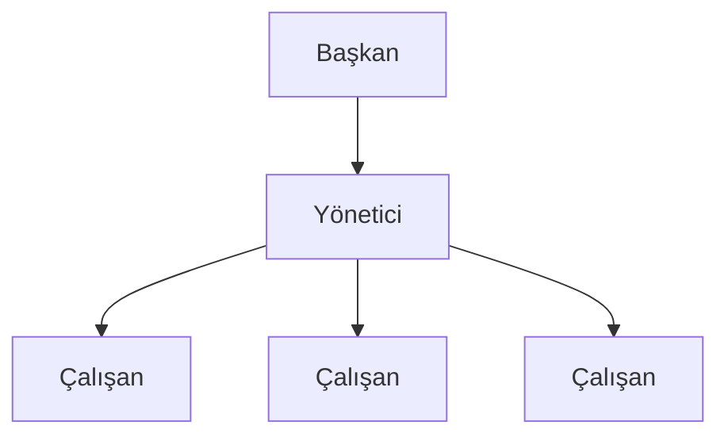

## Obsidian Kısayolları

Bu belge, Obsidian Not Alma Uygulamasının kısayollarını tanıtmak amacıyla hazırlanmıştır.

- [obsidian.md](https://obsidian.md/)
- [YouTube Bölüm 1](https://youtu.be/AGEUEPqbN8M)
- [YouTube Bölüm 2](https://youtu.be/WC4Gxj76uLs)
<br><br><br>


### Bölüm 1

#### Dil Seçimi
Ayarlar > About bölümünden kısmî de olsa Obsidian Türkçe diline ayarlanabilir.

<br>

#### Komut Paneli ve Not açma
CTRL/CMD + P paneli açar. Ya da sol konsoldaki ikon kullanılabilir.
CTRL/CMD + O notları bulmaya yarar. Sol taraftaki Quick Switcher da kullanılabilir.
CTRL/CMD + SHIFT + F Tüm dosyaları bulmaya yarar. (Sol üstteki Search alanı etkinleşir. Tekrar eski hâline dönmek için Klasör görünümü seçilmelidir.)
CTRL/CMD + SHIFT + E'ye Hotkeys'ten kısayol atanabilir ve File Explorer kullanılabilir.

<br>

#### Düzenleme ve Önizleme Görünümleri
CTRL/CMD + E ile geçiş yapılabilir.

<br>

#### Checkbox Ekleme
- [ ] item 1 
- [ ] item 2

Sol CTRL/CMD + Enter ile daha hızlı checkbox eklenebilir.

<br>

#### İç Bağlantı Ekleme
İç bağlantı için `[[ ]]` köşeli parantezlerin içine not adını yazmamız yeterlidir.

Ayarlar > Hotkey'den kısayol eklenebilir. CTRL + i gibi.

İç bağlantı adları çok uzunsa dik çizgi `|` ile bağlantı adları kısaltılabilir.

[[Bu Çok Uzun Bir Not Adı Örneğidir|Örnek Not]]

<br>

#### Dış Bağlantı Ekleme
Dış Bağlantı kelimeleri seçildikten sonra CTRL/CMD + K yapılmalıdır.

[Dış Bağlantı](http://#)

Dış Bağlantı Denemesi İçin Örnek
https://zinzinzibidi.com/excel_dersleri/

Not: Eklentiler bölümünde çok daha hızlı dış bağlantı eklemeyi öğreneceğiz.

<br>

#### Notların Dosya Konumu
Notun üzerine gelip sağ tıklanmalı, açılan listeden "Show in system explorer" seçilmelidir.

<br>

#### Callout Ekleme
Hotkey'den Insert callout'a kısayol atanmalıdır. CTRL + SHIFT + C'ye gibi. Ya da doğrudan CTRL/CMD + P ile eklenebilir.

> [!NOTE] Not
> Lorem ipsum dolor sit amet, consectetur adipiscing elit. Sed malesuada tortor et leo suscipit, at sodales dolor convallis. Maecenas lobortis, ex in mollis rhoncus, lacus tortor facilisis lectus, eget dignissim magna lorem sed magna.

Callout'lar ayrıca bilgi verme amaçlı kullanılabilir. Bunun için NOTE yerine INFO kullanılmalıdır.

> [!INFO] Bilgi
> Quisque non nulla orci. Curabitur egestas nisi non mi volutpat pellentesque. Phasellus ac hendrerit ex. Proin volutpat vestibulum ipsum. Duis varius purus sed diam rutrum, at tincidunt risus pharetra.

Soruların yanıtlanması amacıyla da kullanılabilir. Bunun içinde FAQ kullanılmalıdır. FAQ, Frequently Asked Question'dan yani Sıkça Sorulan Sorular'dan gelir.

> [!FAQ] Obsidian'ın Geliştiricileri Kimlerdir?
> Maecenas cursus bibendum odio. Sed a nunc at dui sollicitudin tincidunt. Proin faucibus vehicula mi, ac sollicitudin urna pulvinar a. Curabitur sit amet pulvinar tortor, vitae imperdiet ante. Maecenas egestas erat ac commodo hendrerit. Mauris suscipit nisi risus, ut pretium nunc mollis eget.

<br>

#### Kalın ve İtalik Yazma
Metin seçili iken CTRL + B kalın yazmaya, CTRL + I ise italik yazmaya yarar. Word'ün İngilizce kısayolları ile aynı. (B bold'dan, I italikten gelir.)

<br>

#### Bul ve Değiştir
CTRL + F bulur. CTRL + H Bul ve Değiştir'i açar. Tümünü değiştir yapılabilir. Esc ile açılan pencereler kapatılabilir. World ve Excel ile aynı.

<br>

#### Not Vurgusu
İki tane eşittir (=) işareti kullanılabilir. Hotkeys'ten "Toggle highlight"'a kısayol atanabilir. CTRL + L gibi. Ya da CTRL + P'den eklenebilir.

Bu bir ==vurgulanmış not== örneğidir.

Not vurgulamalarını daha iyi görebilmek için Ayarlar > Apperance'dan Light görünüme geçilebilir. PDF'lerde daha belirgin olacaktır.

<br>

#### Liste Oluşturma
Eksi işareti ile liste oluşturulabilir.

- Liste 1
- Liste 2
- Liste 3
	- Liste 3.1
	- Liste 3.2

Tab ile alt listeye geçilebilir.

Numaralı liste için 1. 2. 3. yazılması yeterlidir.

1. Liste A
2. Liste B

Not: Daha hızlı liste oluşturmaya eklentileri öğrenirken değineceğiz.
<br>

#### Alıntı Yapma
(>) işareti ile alıntı yapılabilir.

> "Bu bir not alıntısıdır. Başka kaynaktan alındığı varsayılmıştır." 

Tab tuşu ile de farklı bir alıntı stili uygulanabilir. Çoğunlukla kodların kopyalanması amacıyla kullanılır. Fakat okuyucularınıza kopyalatmak istediğiniz metinler için de kullanabilirsiniz.

	Bu bir alıntı örneğidir.
<br>

#### Not Sınırı Ekleme
Üç tane eksi `---` işareti ile not sınırı belirlenebilir.

---

#### PDF'eye Aktarma
Not açıkken sağ üstteki menüden "Export to PDF" seçilir. Ya da CTRL + SHIFT + P'ye hotkey atanabilir.

<br>

#### Harici Belge Ekleme
Hotkey'den Insert attachment'e kısayol atanmalıdır. CTRL + SHIFT + A gibi. Ya da doğrudan CTRL + P ile eklenebilir. Not paylaşılacaksa harici belgeler notun olduğu klasörde olmalıdır. PDF sürümlerinde harici belgeler listelenmeyecektir. Bu yüzden harici belge olduğuna dair not düşülmelidir.

Sürükle - Bırak yöntemi ile de harici belge eklenebilir.

<br>

#### Kalıcı Not Silme
Not adının üzerine gelip sağ tıkla Delete yapabiliriz. Fakat bu geri dönüşüm kutusuna atacaktır. Ayarlar > Files & Links > Deleted Files'tan kalıcı silme seçeneğini seçebiliriz. Eğer notlar kritik öneme sahipse bu özelliğin seçilmemesi gerekir.

Ben OneDrive kullandığım için Obsidian'dan kalıcı olarak sildiğim notları OneDrive'ın Geri Dönüşüm kutusundan kurtarabiliyorum. Bu yüzden bulut yazılımı kullanmıyorsanız bu özelliği etkinleştirmemelisiniz.

Obsidian'da kalıcı silmeyi Obsidian'ın çöp kutusunda (.Trash gizli klasöründe) not bırakmak istemediğim için yapıyorum.

<br>

#### Başlıkları Küçültme
Hotkeys'ten "Fold all headings and list" ve "Unfold all heading and list"e kısayol atanabilir. CTRL + Aşağı ve Yukarı Yön Tuşları ideal.

Bunun yerine birazdan Outline (anahat görünümü) özelliğine değineceğiz.
<br>

#### Tag Pane
Notları etiketlemek için diez (#) işaretini kullanıyoruz.

Ayarlar > Core Plugins > Tage Pane'i etkinleştirdiğimizde sağ bölümde etiketlere ulaşabiliriz.

Dilersek etiket alanını sürükle - bırak ile sol tarafa konumlandırabiliriz.

slash işareti ile etiketleme yaptığımızda alt etiketler belirleyebiliriz.

#obsidian/alt_etiket_1
#obsidian/alt_etiket_2

Etiketler notlar arasında bağlantı kurma ve Graph View görünümü için kritik öneme sahiptir.

<br>

#### Şablonlar
Ayarlar > Core Plugins > Templates'i etkinleştirdiğimizde sol taraftaki kısayol menüsüne "Insert template" ikonu eklenir.

Ayarlar > Templates'den Template klasörü ve tarih formatı belirlenir. Tarih formatı DD.MM.YYYY olarak belirlenirse daha iyi olacaktır.

Templates klasörünün içine şablonlar oluşturulur ve oluşturulan şablonlar "Insert template" ikonu ile eklenir.

Şablonlar başka notların içinde de kullanılabilir.

<br>

#### Sunum Yapma
Sunumlar için --- işaretlerini kullanıyoruz. (Sunum Örneği notunu örnek olarak kullanabiliriz.) Sağ üst menüden "Start presentation"ı seçiyoruz ve sunuma başlıyoruz.

<br>

#### Favori Notlar
Ayarlar > Core plugins > Starred etkinleştirilirse sol üstte yıldız ikonu eklenir. Notların üzerine gelip Star denilirse notlar favorilere alınabilir. Favori notlar sol üst köşedeki Starred alanında görülebilir. Notların üzerine gelip sağ tıkla Unstar yapılabilir.

Hotkeys'ten favorilemek için ALT + S, favori klasörüne görmek için CTRL + SHIFT + S tuşları atanabilir.

<br>

#### Eklenti Klasörü
Obsidian'da görsel, PDF gibi not eklentileri notlar listesinin en altına eklenir. Eklenti klasörü belirlendikten sonra klasör adına sağ tıklanıp "Set as attachment folder" denilebilir. Bu sayede yeni ekler daima eklenti klasörüne eklenecektir.

<br>

#### Günlük Not Oluşturma
Öncelikle Templates'te olduğu gibi günlük not klasörü belirlenir.

Günlük Not şablonu Templates klasörünün içinde oluşturulur.

Ayarlar > Core plugins > Daily Notes etkinleştirilir.

Ayarlar > Daily Notes alanında tarih formatı, günlük notlar klasörü ve şablonu belirlenir. Tarih formatının YYYY.MM.DD olması yerindedir. Çünkü notlar listelenirken alfabetik olarak sıralanacaktır.

Günlük not eklemek için sol menü ikonlarından "Open today's daily note"a tıklanmalıdır.

<br>

#### Emoji Ekleme
Windows için WinKey/Elma + Nokta tuşları ile emoji eklenebilir.

😻

Emojiler özellikle klasör adlarında ve notlarda iyi bir görselleştirme aracı olarak kullanılabilir.

 [[🐶 Köpekler]]
 [[😺 Kediler]]

<br>

#### Temalar
Geldik en çok seveceğiniz bölümlere...

Ayarlar > Apperance > Themes yolundan topluluk temaları kullanılabilir ve Obsidian'ın arayüzü değiştirilebilir.

Özellikle Things teması görülmeye değer.

<br>

#### Topluluk Eklentileri
Ayarlar > Community plugins yolundan Safe Mode "Off"a çekilmelidir. 

<br>

#### Tablo Oluşturma
Advanced Tables topluluk eklentisi ile tablo oluşturulabilir. Eklendikten sonra Enable edilmelidir.

Tablolarda dikey çizgi (|) işareti kullanılmaktadır. İlk satır oluşturulduktan sonra Advanced Tables ile diğer hücreler otomatik oluşturulacaktır.

| Uzun Başlık Örneği 1 | Uzun Başlık Örneği 2 | Uzun Başlık Örneği 3 |
| :--- | :---: | ---: |
| İçerik 1 | İçerik 2 | İçerik 3 |
| İçerik 4 | İçerik 5 | İçerik 6 |
:--- sola, :---: ortaya, ---: sağa hizalar.

<br>

#### Calendar Eklentisi
Calendar yani takvim eklentisi topluluk eklentilerinden eklenebilir. Sağ alanda görüntülencektir. İlgilli tarihe tıklanınca günlük not oluşturulabilir. İleriye dönük notlar için idealdir.

Calendar ile ayrıca daha önce oluşturulan günlük notlara hızlı bir şekilde ulaşılabilir.

<br>

#### Not Sabitleme
Birden fazla notu açarken asıl notun kapanmaması için sağ üst menüden Pin kullanılabilir.

<br>

#### Yan Yana Görünüm
Sol menüden not adının üzerinde sağ tıklayıp açılan listeden "Open in new pane" seçilirse notlar yan yana görüntülenecektir. Bunun yerine not listesinden SOL CTRL/CMD basılı iken notlar açılırsa yan yana görünüme geçilecektir.

Sliding Panes eklentisi ile çok daha güzel sekme görünümü oluşturulabilir.

Eklenti ayarlarından Leaf Auto Width etkinleştirilirse daha geniş bir çalışma alanı oluşacaktır.

SOL SHIFT tuşu basılı iken farenin orta tuşu ile kaydırma etkinleştirilebilir.

<br>

#### Açılış Sayfasını Değiştirme
Obsidian'ı her açışımızda kaldığımız yerden devam eder. Eğer sadece seçtiğimiz notun açılmasını ya da hiçbir notun açılmamasını istiyorsak Homepage adlı eklentiyi kullanabiliriz.

<br>

#### Hatırlatıcı Oluşturma
Reminder eklentisi ile hatırlatıcı notları oluşturulabilir. Eklenti kurulduktan ve etkinleştirildikten sonra sağ panele Reminder sekmesi eklenecektir.

Yeni bir nota hatırlatıcı eklemek için öncelikle checkbox kullanmalıyız. Ardından hatırlatıcı notunu yazmalı ve `(@` yazdıktan sonra açılan takvimden tarih ve gerekli ise zamanı seçmeliyiz.

Eklenti ayarlarından tarih formatını YYYY-MM-DD yerine DD.MM.YYYY olarak değiştirebiliriz.

Örnek format:

```
- [ ] Fatura borcunu ödemeyi unutma. (@26.05.2022)
- [ ] Alper'in doğumgünü için öğlen arası hediye al. (@28.05.2022 12:00)
```

Hatırlatıcılar Obsidian'ı her açtığımızda karşımıza çıkacaktır.

Use system notifications seçimini etkinleştirirsek işletim sisteminin bildirim alanında hatırlatıcılarımız görüntülenebilecektir. Fakat bu özelliğin etkili bir şekilde kullanılabilmesi için Obsidian'ın görev çubuğunda minimize olması gerekmektedir.

Hatırlatıcılar mobil sürüme Reminder eklentisi kurulduğu takdirde telefonda da çalışacaktır.

<br>

#### Akıl Haritası Oluşturma
Topluluk eklentilerinden Mind Map eklentisi kurulabilir, listeler ya da başlıklar yardımıyla akıl haritası oluşturulabilir. (Akıl Haritası notunu inceleyebiliriz.)

Hotkeys'ten kısayolu CTRL + SHIFT + M atanabilir.

Ekran görüntüsü alınabilir ve diğer notlarda kullanılabilir.

<br>

#### Gelişmiş Kısayol Eklentisi
Hotkeys++ eklentisi ile liste ya da yapılacak listesi hızlı bir şekilde oluşturulabilir.

CTRL + M ile toplu checkbox, SHIFT + M ile toplu liste oluşturulabilir. (Hotkeys++ notunu inceleyebiliriz.)

Varsayılan olarak CTRL + SHIFT + M akıl haritasının kısayoludur. Bu yüzden kısayolu SHIFT + M ile değiştirebilirsiniz.

Art arda basılırsa toggle moduna geçecektir.

<br>
#### Hızlı Dış Bağlantı Ekleme
Paste URL into selection eklentisi ile hızlı URL (dış bağlantı) eklenebilir.

Eklenti kurulduktan sonra ekleme yapılacak metin seçilmeli ve kopyalanan URL CTRL/CMD + V ile metnin üzerine yapıştırılmalıdır.

Uygulama:

https://www.youtube.com/watch?v=dQw4w9WgXcQ

Efsane şarkıyı dinlemek için tıklayınız.

<br>

#### Sayfa Önizleme
Ayarlar > Core plugins > Page Preview etkinleştirilebilir. Bu sayede iç bağlantıların üzerine gelindiğinde CTRL/CMD tuşuna basılı tutulabilir ve ilgili notun önizlemesi yapılabilir.

[[Yapılacaklar]]

Okuma modunda CTRL tuşuna basmamıza bile gerek yoktur.

<br>

#### Sesli Not Kaydetme
Yazmak kimi zaman zor geliyorsa Ayarlar > Core plugins > Audio recorder etkinleştirilebilir ve sesli not alınabilir.

Sesli not için sol menüdeki mikrofon simgesine tıklanmalıdır.

![[Recording 20220521142330.webm]]

Sesli notlar, not metninin içinden silinse bile Eklentiler klasöründe yer almaktadır. Tamamen silmek için ses dosyası da silinmelidir.

<br>

#### Web Sitesi Notları Ekleme
[MarkDownload - Markdown Web Clipper](https://chrome.google.com/webstore/detail/markdownload-markdown-web/pcmpcfapbekmbjjkdalcgopdkipoggdi) Chrome/Edge eklentisi ile web sayfaları md formatında masaüstüne indirilebilir ve Obsidian notlarına sürükle - bırak ile eklenebilir.

Firefox eklentisi de bulunmaktadır.

[Martin Eden - Jack London](https://zinzinzibidi.com/blog/kitap/martin_eden) sayfası test edilebilir.

<br>

#### Başlıklar Arası Bağlantı Verme 
Not adı yazıldıktan sonra # simgesi ile notun içindeki başlık adı yazıldığında başlıklar arası bağlantı kurulabilir.

Okuma görünümünde (CTRL + E ile yapıyoruz) "Not Adı > Başlık Adı" şeklinde gösterilecektir.

[[Obsidian Kısayolları#Sayfa Önizleme]]

<br>

#### Varsayılan Okuma Modu
CTRL + P ile panel açıldıktan sonra "Default" yazılır ve "Toogle default new pane mode" ile okuma görünümü değiştirilebilir. Bu sayede yeni notlar açıldığında okuma modunda başlayacaktır. Eski haline getirmek için tekrar toggle yapılmalıdır.

Ayarlar >  Editor > Default New Pane View'den bu ayar değiştirilebilir. Aynı zamanda düzenleme modu kaynak görünümünde gösterilebilir. ^ayarlar

<br>

#### Kod Alıntıları
Programlama dillerine ait kod alıntıları için ALT GR + VİRGÜL ile italik tırnak işareti kullanılmalıdır.

```py
print("Hello World")

a = 200  
b = 33  
if b > a:  
  print("b is greater than a")  
elif a == b:  
  print("a and b are equal")  
else:  
  print("a is greater than b")
```

Okuma görünümünde kodların rengi de değişecektir. Renklerin değişebilmesi için italik tırnak işaretlerinden sonra Python için py, JavaScript için js yazılmalıdır.

Okuma görünümünde kod bloğunun sağ üst köşesindeki Copy ya da py simgesine tıklanırsa kodlar kolayca kopyalanabilir.

Bir notta `satır içi kod` yazmak için sadece bir tane italik tırnak işareti kullanılmalıdır.

<br>

#### Anahat Görünümü
Ayarlar > Core plugins > Outline etkinleştirilirse sağ panelin Outline bölümünde sadece başlıklardan oluşan İçindekiler Tablosu oluşacaktır. Bu sayede notlar içinde hızlı bir şekilde ilgili bölüme gidilebilir.

<br>

#### Çalışma Alanları
Ayarlar > Core plugins > Workspaces etkinleştirilebilir ve çalışma alanları oluşturulabilir. Workspace ikonu sol panele gelecektir. Bu sayede ilgil çalışma alanı yüklendiğinde ilgili not ve o çalışma alanına ait arayüz açılacaktır. Sağ panel kapalıysa workspace açıldığında panel açık konuma gelebilecektir. Workspace nasıl kaydedilirse o şekilde gösterilecektir.

<br>

#### Dipnot Ekleme
`[^1]` kodları ile dipnot eklenebilir.

Dipnotları okuyabilmek için düzenle görünümünde çıkılmalı ve CTRL + E ile okuma moduna geçilmelidir.

Dipnot Örneği

Lorem ipsum dolor sit amet, consectetur adipiscing elit. Sed malesuada tortor et leo suscipit, at sodales dolor convallis. Maecenas lobortis, ex in mollis rhoncus, lacus tortor facilisis lectus, eget dignissim magna lorem sed magna. Orci varius natoque penatibus et magnis dis parturient montes, nascetur ridiculus mus. Nunc vehicula, tellus in finibus malesuada, nisl sapien dictum elit, vel fringilla augue risus vel diam. Interdum et malesuada fames ac ante ipsum primis in faucibus. Quisque euismod nibh id nulla pharetra imperdiet. Proin lacus diam, finibus commodo aliquet ac, pharetra in enim. Cras eget risus eu eros dignissim ultricies. Nullam molestie, lacus eu consectetur semper, justo mauris pellentesque leo, vel sodales eros eros a urna.[^1]

Fusce blandit magna sed consequat hendrerit. Quisque egestas arcu id ipsum congue, sit amet condimentum orci maximus. Proin odio felis, aliquam vel faucibus et, luctus eget lacus. Nunc scelerisque pharetra tortor ullamcorper accumsan. Aenean ultricies placerat facilisis. Fusce eget ex sed velit sagittis condimentum. Phasellus tortor mauris, fermentum eget elit ac, finibus aliquet metus. Donec nunc urna, convallis at imperdiet sed, dictum ac ligula. Vestibulum a tincidunt justo, vitae tempor elit. Vivamus odio odio, faucibus tempus luctus cursus, luctus eget leo. Nullam dapibus ut lacus nec ornare. Donec vel libero eget elit egestas commodo. Nunc posuere porttitor purus ac tincidunt. Integer nec felis massa. Maecenas laoreet metus vitae enim tempor, a aliquam justo viverra. Maecenas euismod vehicula hendrerit.[^2]

Quisque non nulla orci. Curabitur egestas nisi non mi volutpat pellentesque. Phasellus ac hendrerit ex. Proin volutpat vestibulum ipsum. Duis varius purus sed diam rutrum, at tincidunt risus pharetra. Vivamus suscipit porta est at condimentum. Nullam sit amet ullamcorper magna. Maecenas cursus bibendum odio. Sed a nunc at dui sollicitudin tincidunt. Proin faucibus vehicula mi, ac sollicitudin urna pulvinar a. Curabitur sit amet pulvinar tortor, vitae imperdiet ante. Maecenas egestas erat ac commodo hendrerit. Mauris suscipit nisi risus, ut pretium nunc mollis eget.[^3]

[^1]: Dipnot örneği 1
[^2]: Dipnot örneği 2
[^3]: Dipnot örneği 3

Dipnotları paragrafların altına yazsak dahi okuma görünümünde en altta görüntülenecektir.

<br>

#### Çoklu İmleç Kullanma

```py
print("Hello World")

a = 200  
b = 33  
if b > a:  
  print("b is greater than a")  
elif a == b:  
  print("a and b are equal")  
else:  
  print("a is greater than b")

```

Sol ALT tuşu basılı iken ilgili metinler seçilirse çoklu imleç kullanılabilir. Örneğin; yukarıdaki kodlarda a değişkenini z olarak değiştirebiliriz.

<br>

#### Satır Boşluğu Bırakma
`<br>` html etiketi ile satır boşlukları bırakılabilir ve okunurluk artırılabilir. Satır boşlukları sadece okuma görünümünde etkili olacaktır.

<br>

#### Görsel Boyutlandırma
Görselleri yeniden boyutlandırmak için `![[gorseladi.jpg|160]]` kodu kullanılabilir. Sadece genişliğe göre boyutlandırma yapacaktır.

![[cicek3.jpg|160]]

Tam boyutlandırma için `![[gorseladi.jpg|160x160]]` genişlik ve yükseklik değerleri belirlenmelidir.

![[bisiklet.png | 480]]
png görsellerinin arkaplanı transparan olabildiği için notlarda çok güzel görüntülencektir. Yukarıdaki görsel şu an kullandığım bisikletim bu arada. =)

<br>

#### Uzun Notlarda Gezinme
Bu not gibi çok uzun notlarda CTRL/CMD + Home ve CTRL/CMD + End ile notun en üstüne ve en altına gidilebilir. Page Up ve Page Down tuşları kullanılabilir.

<br>

#### Belirli Bir Paragrafa Bağlantı Verme
Notlar içindeki belirli bir paragrafa bağlantı vermek için `[[Not Adı#^paragraf]]` kodları kullanılmalıdır. `^paragraf` işaretlemesi daha önce oluşturulmuş olmalıdır.

[[Obsidian Kısayolları#^ayarlar|Varsayılan Okuma Modu Ayarları]]

<br>

#### Sorgu Blokları

```
```query
tag: #hayvanlar

```

sorgu kodları ile etiketler aranabillir ve notun içinde gösterilebilir.

```query
tag: #hayvanlar
```

<br>

#### YouTube Videoları Ekleme

YouTube videoları Paylaş > Yerleştir ile notlara eklenebilir. Aynı zamanda iframe içerikli tüm videolar eklenebilir. Genişlik ve yükseklik ayarları belirlenebilir.

https://youtu.be/mG04arbQn8M

<iframe width="560" height="315" src="https://www.youtube.com/embed/mG04arbQn8M" title="YouTube video player" frameborder="0" allow="accelerometer; autoplay; clipboard-write; encrypted-media; gyroscope; picture-in-picture" allowfullscreen></iframe>

<br>

#### Graph View Renkleri
Ayarlar > Groups'tan etiketlere renk verilebilir. Forces alanından sıkılıkları değiştirilebilir.

Dilersek Graph View'i sağ ya da sol tarafa da konumlandırabiliriz.

<br>

#### SmartArt Grafiği Ekleme

[Mermaid Live Editor](https://mermaid.live/) ile şemalar oluşturulabilir. Mermaid'daki kodlar `mermaid` etiketi ile notlarda kullanılabilir.



[mermaid-js.github.io](https://mermaid-js.github.io/mermaid/#/) adresinden dokümantasyon kodlarına ulaşılabilir.

<br>

#### Metin Boyutlarını Değiştirme
Sol CTRL/CMD tuşu basılı iken farenin orta tuşu ileri - geri yapılarak Word ve Excel'de olduğu gibi metin boyutu değiştirilebilir.

Ayarlar > Appearance > Font Size'dan da font büyüklüğü değiştirilebilir.

<br>

#### Matematik ve İstatistik Formülleri

Obsidian'da matematik, istatistik, fizik gibi alanlarda kullanılan formüller not olarak alınabilir. Formülleri göstermek için MathJax kodlarını 2 dolar işareti `$$` arasında yazmamız yeterlidir.

[MathJax](https://www.mathjax.org/)
$$ s = \sqrt{ { \Sigma (x_i - \bar x)^2 } \over n } $$

Formülü paragraf içinde göstermek için sadece bir kez $ işareti kullanılmalıdır. Örneğin;

Bir reel değişkenin reel-değerli fonksiyonu olan f(x)’in c değeri etrafında (n)inci momenti $\mu_n^{'} = \int_{-∞}^∞ (x-c)^n f(x) dx$ şeklinde ifade edilir.

Tek başına göstermek isteseydik tek dolar işareti `$` yerine çift dolar işareti `$$` kullanmamız yeterlidir:

$$\mu_n^{'} = \int_{-∞}^∞ (x-c)^n f(x) dx$$
Obsidian'ın formüller konusunda hem satır içinde hem de ayrı gösterimde ne kadar esnek olduğu görülebilir.

MathJax formüllerinin nasıl kullanılacağı üzerine [Stack Exchange](https://math.meta.stackexchange.com/questions/5020/mathjax-basic-tutorial-and-quick-reference) sayfası ziyaret edilebilir.

<br>

### Bölüm 2

#### Deep Work Teması
GitHub Temasına en yakın Deep Work teması kullanılabilir.

Ayarlar > Appearance > Themes'in yanındaki klasör ikonuna tıklanabilir ve bilgisayardaki Themes klasörü açılır. Temaların CSS özellikleri değiştirilebilir.

Geliştiricilerle iletişime geçilebilir.

[GitHub Geri Bildirimi](https://github.com/nikbrunner/obsidian-deep-work-theme/discussions/76)

<br>

#### Font Seçimi ve CSS Snippets Kullanımı
Ayarlar > Appearance > Font ile istenilen font kullanılabilir.

Bilgisayarda bulunan fontları eklemek için

Ayarlar > Appearance > CSS Snippets klasörü açılır. Boş bir not defteri oluşturulur. Adı ve uzantısı silinir. obsidian.css adlı yeni bir CSS dosyası oluşturulur. Not defteri ile dosya açılır ve içine

```css
* {
  /* Tüm arayüzün fontunu değiştir. */
  font-family: "Century Gothic", Avignon-PS, Verdana !important;
}

.cm-s-obsidian,
.markdown-preview-view {
  /* Sadece içeriğin fontunu değiştirir. */
  font-family: "Century Gothic", Avignon-PS, Verdana !important;
}

.cm-header-1,
.cm-header-2,
.cm-header-3,
.cm-header-4,
.cm-header-5,
.cm-header-6,
.markdown-preview-view h1,
.markdown-preview-view h2,
.markdown-preview-view h3,
.markdown-preview-view h4,
.markdown-preview-view h5,
.markdown-preview-view h6 {
  /* Sadece başlıkların fontunu değiştirir. */
  font-family: "Century Gothic", Avignon-PS, Verdana !important;
}
```

kodları yazılır.

Eklenmek istenen font `C:\Windows\Fonts` adresinde yoksa harici bağlantılardan indirilir ve kurulur.

[Century Gothic Font İndir](https://freefontsdownload.net/free-century-gothic-font-32089.htm)

Font adları  `C:\Windows\Fonts` adresindeki dosyalar açıldığında sol üstte yazmaktadır. (Avignon-PS örneği)

*İtalik cümle örneği*
**Kalın cümle örneği**
<br>

#### Çok Fazla Dipnot Kullanımı
Lorem ipsum dolor sit amet, consectetur adipiscing elit. In id nisi quis nisi blandit faucibus. Nulla mattis feugiat euismod. Nunc sit amet tempor tortor. Integer laoreet felis neque, ac euismod purus rhoncus et. Etiam sed lacus aliquam, congue sapien eget, tincidunt enim. Phasellus vel ex eget lorem mattis ornare id vel diam.^[Birinci dipnot açıklaması] Nunc nec tellus eu dui accumsan facilisis. Cras lacinia lacus sollicitudin turpis convallis, nec consequat eros feugiat.^[İkinci dipnot açıklaması] In malesuada fermentum tellus ac condimentum. Praesent sit amet nisl at mauris tempor ullamcorper finibus id metus. Sed placerat in arcu at sollicitudin.^[Üçüncü dipnot açıklaması]

<br>

#### Yeni Notlar
Yeni notları belirli bir klasöre kaydetmek için Ayarlar > Files & Links > Default location for new notes > In the folder specified below > "Yeni Notlar" klasörü yolu izlenir.

<br>

#### Obsidian Clipper Tarayıcı Eklentisi
[Chrome/Edge](https://chrome.google.com/webstore/detail/obsidian-clipper/mphkdfmipddgfobjhphabphmpdckgfhb)
(Microsoft Edge Chromium tabanlıdır.)
(Firefox'ta sorunlu. Eski bir Firefox kullanıcısı olarak Edge'i tavsiye ederim.)

Vault Name
```
{Obsidian Vault Adı ile Birebir Aynı Olmalıdır}
```

Note to clip to
```
{Klasör Adı}/{year}.{month}.{day} {title}
```
<small>Videoda "Web Sitesi Notları" klasörünü kullandım.</small>

Clipping format
```
{clip}^[[{title}]({url})({date})]
```

Datetime format
```
DD.MM.YYYY HH:mm:ss
```

Date format
```
DD.MM.YYYY
```

**Save** yapmayı unutmayın.

[Örnek Site](https://zinzinzibidi.com/blog/kitap/savas_ve_baris)

Not alma başarısız olursa Obsidian Clipper eklenti ayarlarının en altındaki **Test Configuration** düğmesi kullanılmalıdır.

Resimler sürükle - bırak ile notların içine eklenebilir.

<br>

#### Telefonlar için Advanced Mobile Toolbar Eklentisi
[Advance Mobile Toolbar](https://github.com/phibr0/obsidian-advanced-toolbar)


Satır sayısı değiştirilebilir.


Toolbar Row Count ile satır sayısı 2 yapılabilir.

Not: Mobil eklentiler sadece mobilde, bilgisayar eklentileri sadece bilgisayarda çalışır. Bunun dışında tema, font tipi gibi diğer tüm görsel ayarlar hem mobilde hem de bilgisayarda çalışır.

<br>

#### Map View Eklentisi
Map View İstanbul, Ankara ve Denizli Notu

CTRL + P ile palet açıldıktan sonra Map yazılması ve "Add geolocation (front matter) ..." komutunun seçilmesi

"Ataşehir'de Yaşadıklarım" adlı yeni bir not oluşturulup  ve "Ataşehir Barbaros Mahallesi"ni haritadan seçilebilir.

<br>

#### Recent Files Eklentisi
Sol üstte Recent Files alanı ekler ve son açılan notlar listelenir. CTRL + SHIFT + R'ye klavye kısayolu atanabilir.

Bu şekilde CTRL + SHIFT + E, F, S ve R kısayolları birlikte kullanılabilir.

<br>

#### Advanced Tables Sağ Panel Kısayolları
Sağ panelden Advanced Tables kısayolları kullanılabilir.

| Ad     | Soyad  | Şehir    |
| ------ | ------ | -------- |
| Mehmet | ŞİMŞEK | Ankara   |
| Erdal  | YILMAZ | Ankara   |
| Ahmet  | BAL    | İstanbul |
| Ayşe   | YÜKSEL | İzmir    |

<br>

#### Tasks Eklentisi
Community Plugin'de Tasks eklentisi ve SHIFT + ENTER kısayolu ile kullanımı

Due (Bitiş Zamanına) Today yazınca bugünü açması

Reminder eklentisi ile kullanılınca daha etkilidir.

<br>

#### Memos Eklentisi
Obsidian Memos eklentisi ile kısa notlar alınabilir. Calendar ve Obsidian Big Calendar eklentileri ile senkronize çalışır. Big Calendar eklentisine birazdan değinilecektir. Kaydedilen notlar Günlük Notlar (Daily Notes) klasöründe listelenir.

<br>

#### Big Calendar Eklentisi
Obsidian Big Calendar eklentisi ile büyük takvim kullanılabilir. Memos ve Calendar eklentileri ile senkronize çalışır. Memos'ta olduğu gibi tüm notlar Günlük Notlar (Daily Notes) klasöründe listenir.

<br>

#### Şifrelenmiş Not Oluşturma
Meld Encrypt eklentisi ile şifrelenmiş notlar oluşturulabilir. Oluşturmak ve kaldırmak için Palet'te "meld" yazılması ve "Whole Note" seçilmesi yeterlidir.

Şifreleme Obsidian'ı açıp kapattıktan sonra işe yaramaktadır.

<br>

---

#obsidian
